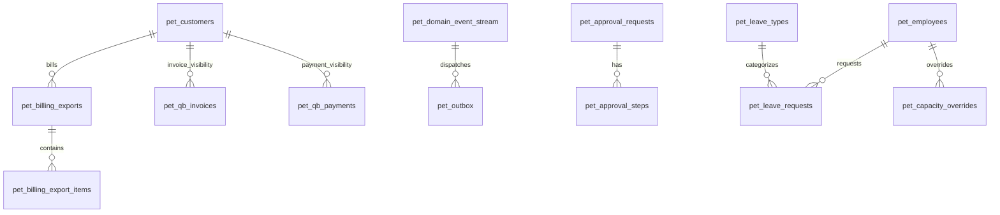

# PET Missing Pieces Specification Pack v3 (DDD-Layered, QuickBooks-First)

Date: 2026-02-14  
Status: PROPOSED (Becomes authoritative once accepted)  
Replaces: v2 for implementation guidance (v2 may be ignored)

This spec is **implementation-oriented** and explicitly encodes PET’s **DDD layer boundaries** and **QuickBooks-first finance model**.

---

## 0) Scope

This pack fills the “demo-whole-system” gaps that are not present in current migrations:

1) **Event Backbone** (immutable event stream + projections + outbox)  
2) **QuickBooks-first Billing** (billing exports + QB shadow read models + mappings)  
3) **Integration Governance** (sync runs, idempotency, reconciliation)  
4) **Approvals Engine** (generic, append-only)  
5) **Leave & Capacity Realism** (leave requests/types + capacity overrides)  
6) Optional: **Commercial Pipeline** (opportunities + CRM activities)

It intentionally does **not** turn PET into an accounting system.

---

## 1) Non-negotiable rules (binding)

### 1.1 Immutability
- Domain events are insert-only.
- Posted finance outcomes (synced from QB) are never edited; updates occur by **re-sync** or **new QB events**.
- Approval decisions are immutable; changes require a new request.
- Leave approvals are immutable; changes require cancellation + new request.

### 1.2 QuickBooks-first
- PET does **not** create authoritative invoices or payments.
- PET exports **billable completion facts** to QB.
- PET ingests QB invoices/payments as **read models** for customer visibility.

### 1.3 Backward compatibility
- Additive migrations only.
- Payloads and schemas evolve via `*_schema_version` or tolerant readers.

### 1.4 Layer boundaries
- **Domain**: entities, invariants, state machines, domain events (no WP, no DB, no HTTP).
- **Application**: commands/handlers, transactions, orchestration.
- **Infrastructure**: repositories, persistence, migrations, integrations (QB), outbox dispatch.
- **UI**: REST endpoints, admin screens, SPA components (no business rules).

---

## 2) Layered architecture map (what goes where)

### 2.1 Domain Layer (pure)
#### Aggregates / Entities
- `BillingExport` (aggregate)
- `ApprovalRequest` (aggregate)
- `LeaveRequest` (aggregate)
- `IntegrationRun` (entity/value object depending on implementation)
- `ExternalMapping` (entity; can be repository-backed)

#### Domain Events (minimum set)
**Billing**
- `BillingExportCreated`
- `BillingExportItemAdded`
- `BillingExportQueued`
- `BillingExportSentToQuickBooks`
- `BillingExportFailed`
- `QuickBooksInvoiceUpserted` (projection-triggered; may be recorded as event for audit)
- `QuickBooksPaymentUpserted`

**Approvals**
- `ApprovalRequested`
- `ApprovalApproved`
- `ApprovalRejected`
- `ApprovalCancelled`

**Leave**
- `LeaveSubmitted`
- `LeaveApproved`
- `LeaveRejected`
- `LeaveCancelled`
- `CapacityOverrideSet`

**Integration**
- `IntegrationRunStarted`
- `IntegrationRunCompleted`
- `IntegrationRunFailed`

#### State machines (hard blocks)
- BillingExport: `draft → queued → sent|failed → confirmed`
- ApprovalRequest: `pending → approved|rejected|cancelled`
- LeaveRequest: `draft → submitted → approved|rejected|cancelled`

### 2.2 Application Layer (orchestrators)
Commands (examples):
- `CreateBillingExport`
- `AddBillingExportItem`
- `QueueBillingExportForQuickBooks`
- `RecordQuickBooksInvoiceSnapshot`
- `RecordQuickBooksPaymentSnapshot`
- `RequestApproval`
- `ApproveRequest`
- `RejectRequest`
- `SubmitLeaveRequest`
- `ApproveLeaveRequest`
- `RejectLeaveRequest`
- `SetCapacityOverride`
- `RunQuickBooksSyncPull`
- `RunQuickBooksSyncPush`

Application services must:
- open transaction
- load aggregate(s)
- enforce invariants via domain
- append domain events
- persist aggregates + events
- enqueue outbox entries (in same transaction)

### 2.3 Infrastructure Layer
- DB migrations for tables below
- Repositories for aggregates
- Event store append
- Projection workers (offset tracking)
- Outbox dispatcher
- QuickBooks connector (push/pull, idempotent)

### 2.4 UI Layer
- Admin pages + REST endpoints
- Purely calls application commands
- No direct DB writes bypassing handlers

---

## 3) Database structures (Additive)

### 3.1 Event Backbone (truth)

#### `pet_domain_event_stream` (append-only)
- `id` bigint PK auto
- `event_uuid` char(36) UNIQUE
- `occurred_at` datetime INDEX
- `recorded_at` datetime INDEX
- `aggregate_type` varchar(64) INDEX
- `aggregate_id` bigint INDEX
- `aggregate_version` int INDEX
- `event_type` varchar(128) INDEX
- `event_schema_version` int DEFAULT 1
- `actor_type` varchar(32) (employee|system|integration)
- `actor_id` bigint NULL
- `correlation_id` char(36) NULL INDEX
- `causation_id` char(36) NULL INDEX
- `payload_json` longtext NOT NULL
- `metadata_json` longtext NULL

Indexes:
- UNIQUE(event_uuid)
- (aggregate_type, aggregate_id, aggregate_version)
- (occurred_at)
- (event_type)

Rule: insert-only. No UPDATE/DELETE paths.

#### `pet_projection_offsets`
- `projection_name` varchar(128) UNIQUE
- `last_event_id` bigint
- `updated_at` datetime

#### `pet_outbox`
- `id` bigint PK
- `event_id` bigint FK → pet_domain_event_stream.id
- `destination` varchar(64) (quickbooks|email|webhook)
- `status` enum(pending,sent,failed,dead)
- `attempt_count` int
- `next_attempt_at` datetime INDEX
- `last_error` text NULL
- `created_at` datetime
- `updated_at` datetime

Rule: outbox row created transactionally with event append.

---

### 3.2 QuickBooks integration primitives (authority split)

#### `pet_external_mappings`
- `id` bigint PK
- `system` enum(quickbooks)
- `entity_type` varchar(64)
- `pet_entity_id` bigint
- `external_id` varchar(128)
- `external_version` varchar(64) NULL
- `created_at` datetime
- `updated_at` datetime

Indexes:
- UNIQUE(system, entity_type, pet_entity_id)
- UNIQUE(system, entity_type, external_id)

#### `pet_integration_runs`
- `id` bigint PK
- `uuid` char(36) UNIQUE
- `system` enum(quickbooks)
- `direction` enum(push,pull)
- `status` enum(running,success,failed)
- `started_at` datetime
- `finished_at` datetime NULL
- `summary_json` longtext NULL
- `last_error` text NULL

---

### 3.3 Billing exports (PET-owned “what to bill”)

#### `pet_billing_exports`
- `id` bigint PK
- `uuid` char(36) UNIQUE
- `customer_id` bigint FK → pet_customers.id
- `period_start` date
- `period_end` date
- `status` enum(draft,queued,sent,failed,confirmed)
- `created_by_employee_id` bigint FK → pet_employees.id
- `created_at` datetime
- `updated_at` datetime

Indexes:
- (customer_id, status)
- (period_start, period_end)

Rule: only `draft` may be edited. Once queued, changes require new export.

#### `pet_billing_export_items`
- `id` bigint PK
- `export_id` bigint FK → pet_billing_exports.id
- `source_type` enum(time_entry,baseline_component,adjustment)
- `source_id` bigint
- `quantity` decimal(14,2)
- `unit_price` decimal(14,2)
- `amount` decimal(14,2)
- `description` text
- `qb_item_ref` varchar(128) NULL (QB Item/Service reference)
- `status` enum(pending,exported,failed)
- `created_at` datetime

Indexes:
- (export_id)
- (source_type, source_id)

Rule: items are immutable after export is queued.

---

### 3.4 QuickBooks shadow read models (QB-owned truth mirrored)

#### `pet_qb_invoices` (read-only in PET)
- `id` bigint PK
- `customer_id` bigint FK → pet_customers.id
- `qb_invoice_id` varchar(128) UNIQUE
- `doc_number` varchar(64) NULL
- `status` varchar(32) (QB status codes normalized)
- `issue_date` date
- `due_date` date NULL
- `currency` varchar(8)
- `total` decimal(14,2)
- `balance` decimal(14,2)
- `raw_json` longtext
- `last_synced_at` datetime

Indexes:
- (customer_id, balance)
- (last_synced_at)

#### `pet_qb_payments` (read-only in PET)
- `id` bigint PK
- `customer_id` bigint FK → pet_customers.id
- `qb_payment_id` varchar(128) UNIQUE
- `received_date` date
- `amount` decimal(14,2)
- `currency` varchar(8)
- `applied_invoices_json` longtext NULL
- `raw_json` longtext
- `last_synced_at` datetime

Indexes:
- (customer_id, received_date)
- (last_synced_at)

---

### 3.5 Approvals engine (generic, append-only)

#### `pet_approval_requests`
- `id` bigint PK
- `uuid` char(36) UNIQUE
- `request_type` varchar(64)
- `subject_type` varchar(32)
- `subject_id` bigint
- `status` enum(pending,approved,rejected,cancelled)
- `requested_by_employee_id` bigint FK → pet_employees.id
- `requested_at` datetime
- `decided_by_employee_id` bigint NULL FK → pet_employees.id
- `decided_at` datetime NULL
- `decision_reason` text NULL
- `request_payload_json` longtext NOT NULL (immutable snapshot)
- `created_at` datetime

Indexes:
- (status, requested_at)
- (subject_type, subject_id)

Rule: no edits after create other than controlled status transition.

#### `pet_approval_steps` (optional; include for multi-step)
- `id` bigint PK
- `approval_request_id` bigint FK
- `step_number` int
- `approver_type` enum(employee,team_role)
- `approver_reference_id` bigint
- `status` enum(pending,approved,rejected,skipped)
- `decided_at` datetime NULL
- `decision_reason` text NULL
- `created_at` datetime

---

### 3.6 Leave & capacity

#### `pet_leave_types`
- `id` bigint PK
- `name` varchar(64)
- `paid_flag` tinyint
- `created_at` datetime

#### `pet_leave_requests`
- `id` bigint PK
- `uuid` char(36) UNIQUE
- `employee_id` bigint FK → pet_employees.id
- `leave_type_id` bigint FK → pet_leave_types.id
- `start_date` date
- `end_date` date
- `status` enum(draft,submitted,approved,rejected,cancelled)
- `submitted_at` datetime NULL
- `approved_by_employee_id` bigint NULL FK → pet_employees.id
- `approved_at` datetime NULL
- `notes` text NULL
- `created_at` datetime
- `updated_at` datetime

Indexes:
- (employee_id, status)
- (start_date, end_date)

#### `pet_capacity_overrides` (append-only)
- `id` bigint PK
- `employee_id` bigint FK
- `effective_date` date
- `capacity_pct` int (0..100)
- `reason` text
- `created_at` datetime

Rule: derived capacity = calendar windows + holidays + approved leave + latest override.

---

### 3.7 Optional pipeline (only if you want it in demo narrative)

#### `pet_opportunities`
- `id` bigint PK
- `customer_id` bigint NULL FK
- `lead_id` bigint NULL FK → pet_leads.id
- `name` varchar(255)
- `stage` enum(qualifying,scoping,proposal,negotiation,won,lost)
- `estimated_value` decimal(14,2)
- `probability_percent` int
- `expected_close_date` date NULL
- `owner_employee_id` bigint FK → pet_employees.id
- `status` enum(open,won,lost,archived)
- `won_at` datetime NULL
- `lost_at` datetime NULL
- `loss_reason` text NULL
- `created_at` datetime
- `updated_at` datetime

#### `pet_crm_activities`
- `id` bigint PK
- `opportunity_id` bigint NULL FK
- `lead_id` bigint NULL FK
- `customer_id` bigint NULL FK
- `activity_type` enum(call,email,meeting,note,task)
- `subject` varchar(255)
- `body` text NULL
- `due_at` datetime NULL
- `completed_at` datetime NULL
- `owner_employee_id` bigint FK
- `created_at` datetime

---

## 4) Relationships (Mermaid ERD)

---

## 5) UI contracts (screen-level)

### 5.1 Finance → Billing Exports
**Purpose**: create a billing package to push to QB.

Views:
- List exports (filter: customer, status, period)
- Export detail (items, totals, status, errors)

Actions:
- Create draft export
- Add items (from time entries / baseline components / adjustments)
- Queue export (irreversible)
- Retry failed export (creates new outbox attempts; does not mutate history)
- Confirm export (manual confirmation post-QB success, optional)

Hard rules:
- Only draft exports mutable.
- Once queued, items are read-only.

### 5.2 Finance → QuickBooks Invoices (Read-only)
Views:
- Invoice list (filter: customer, balance>0, date range)
- Invoice detail (raw JSON + normalized fields)
- Link back to originating export via mapping (if implemented)

Actions:
- None (read-only).

### 5.3 Finance → QuickBooks Payments (Read-only)
Views:
- Payments list (filter: customer, date)
- Payment detail (applied invoices)

Actions:
- None (read-only).

### 5.4 Governance → Approvals
Views:
- Pending approvals queue
- Request detail (payload snapshot)
- Decision history

Actions:
- Approve / Reject / Cancel (where permitted)
Rules:
- Decision creates domain event; no edits.

### 5.5 People → Leave
Views:
- My leave requests
- Team leave requests (manager)
- Calendar overlay (existing calendars + leave)

Actions:
- Create draft → submit
- Approve / reject (manager)
- Cancel (creates new event/state transition)

### 5.6 System → Event Stream
Views:
- Filtered list by aggregate_type/id, event_type, date range
- Event detail (payload, correlation, actor)
Actions:
- None.

---

## 6) Integration behavior (QuickBooks)

### 6.1 Push (PET → QB)
Trigger:
- BillingExport queued.

Mechanism:
- Append domain event → write outbox row destination=quickbooks.
- Outbox worker sends to QB, idempotent using `event_uuid`/export uuid.

Success:
- Create/update `pet_external_mappings` for QB invoice ID if QB returns it.
- Record `pet_integration_runs` entry.
- Append `BillingExportSentToQuickBooks` event.

Failure:
- Increment outbox attempt, set next_attempt_at, append `BillingExportFailed` event when terminal.

### 6.2 Pull (QB → PET)
Schedule:
- periodic pull (or webhook-driven) to sync invoices + payments.

Mechanism:
- `pet_integration_runs` row for pull.
- Upsert `pet_qb_invoices` / `pet_qb_payments` by QB IDs.
- Append events `QuickBooksInvoiceUpserted`, `QuickBooksPaymentUpserted` (optional but recommended for audit).

Idempotency:
- Upsert keyed by QB ids + version/updatedTime if available.
- Never delete; mark missing as `status=deleted` if QB indicates.

---

## 7) Notes to devs (non-negotiable implementation guidance)

1. **No UI writes directly to tables**: all writes through application commands.  
2. **No updates to event stream**: ensure DB constraints + repository enforcement.  
3. **Outbox is mandatory**: no direct QB calls inside UI requests that bypass outbox.  
4. **Shadow tables are read-only**: QB is authority for invoice/payment states.  
5. **Don’t reintroduce accounting**: no journals, no AR ledger, no tax engine.  
6. **Design for reconciliation**:
   - store raw_json
   - capture last_synced_at
   - store integration run summaries + errors

---

## 8) Phased implementation plan (demo-driven)

### Phase 1 (Demo-critical: finance visibility + export)
- Migrations for: event stream, projection offsets, outbox
- Migrations for: external mappings, integration runs
- Migrations for: billing exports + items
- Migrations for: qb invoices/payments shadow tables
- Application handlers for: create/queue export, outbox dispatch skeleton
- UI pages: billing exports, qb invoices/payments read-only
- Minimal QB connector stub/mock (local)

### Phase 2 (Governance + realism)
- Approvals engine tables + handlers + UI
- Leave tables + handlers + UI
- Connect approvals to sensitive actions (e.g., export confirmation override)

### Phase 3 (Production hardening)
- Projection worker + offset tracking
- Webhook support or scheduled pulls
- Reconciliation screens (diff/health)
- Optional pipeline (opportunities/activities)

---

## 9) Test plan (must exist before demo activation is “complete”)

### 9.1 Domain unit tests
- BillingExport state machine blocks illegal transitions
- ApprovalRequest state machine blocks illegal transitions
- LeaveRequest state machine blocks illegal transitions
- Domain event creation schema versioning compatible

### 9.2 Infrastructure tests
- Event append monotonic aggregate_version enforcement
- event_uuid uniqueness rejects duplicates
- Outbox retry schedules increase attempt_count and respect next_attempt_at
- Shadow table upsert idempotency (same QB payload twice ⇒ no duplication)

### 9.3 Integration tests (QB mock)
- Queue export ⇒ outbox row created in same transaction
- Outbox dispatch ⇒ QB mock invoked ⇒ mapping created ⇒ export marked sent (via event/projection)
- Pull invoices ⇒ qb shadow upsert ⇒ read-only UI reflects changes
- Pull payments ⇒ balances reflected for customer

### 9.4 Immutability tests
- Queued export cannot be modified (items/period/customer)
- Approved/rejected approval requests cannot be edited
- Approved leave cannot be edited; must cancel + re-request
- No deletes from event stream

### 9.5 Demo activation tests (seed/purge)
- Seed tags applied to all seeded rows
- Purge deletes seeded rows not touched
- Purge archives seeded rows touched
- Purge preserves immutable records (queued exports, approvals decided, leave approved)
- Purge never deletes qb shadow tables unless explicitly configured as demo-only

---

## 10) Demo activation requirements (QuickBooks-first)

For a comprehensive demo without live QB:
- Use QB mock connector to generate realistic invoice/payment shadows.
- Seed:
  - customers, sites, contacts, employees, teams (already exist)
  - billing exports + items
  - qb invoices/payments shadows
  - a few approvals + leave requests to show governance + realism
- Ensure “reset demo” uses seed_run_id tagging (existing JSON fields where available) and purge rules.

---

## 11) Non-goals (explicit)

PET will not:
- become a general ledger
- compute tax as accounting authority
- post accounting journals
- manage AR in lieu of QB
- allow inbound QB data to mutate PET operational truth directly

---

## 12) Deliverables checklist (what “done” means)

- [ ] Additive migrations merged
- [ ] Command handlers implemented with strict layer boundaries
- [ ] Outbox worker running + idempotent
- [ ] QB mock + pull/push flows validated by tests
- [ ] UI pages implemented with read-only constraints where required
- [ ] Demo seed + purge passes automated validation tests
- [ ] Demo script can show: “Delivered → Export → QB invoice visible → Payment visible → customer balance”
